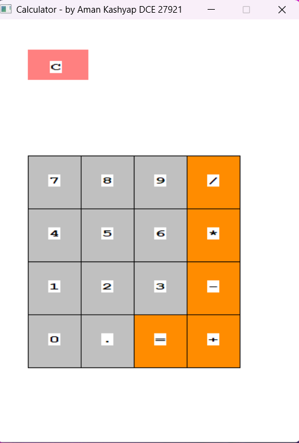
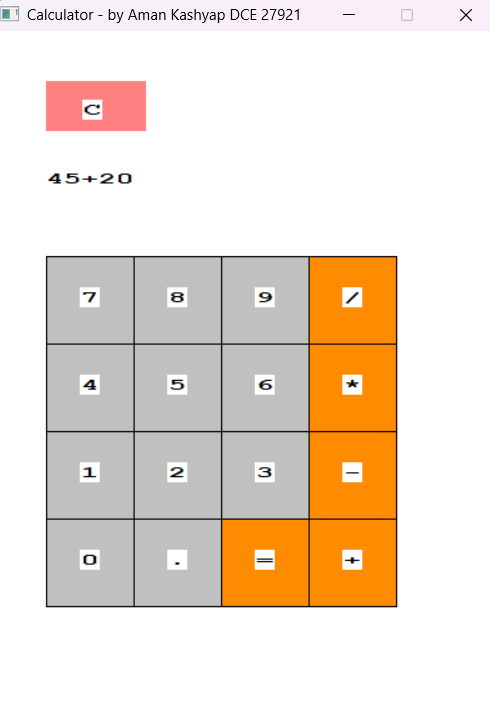
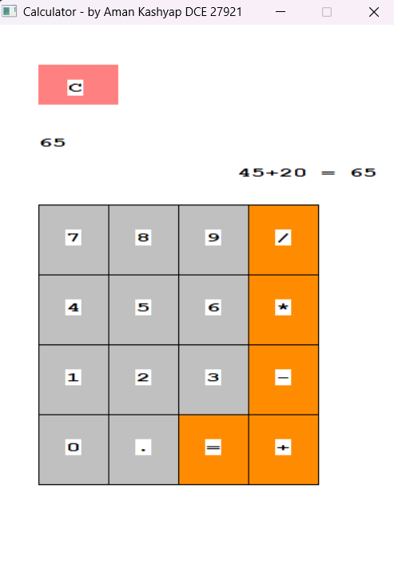
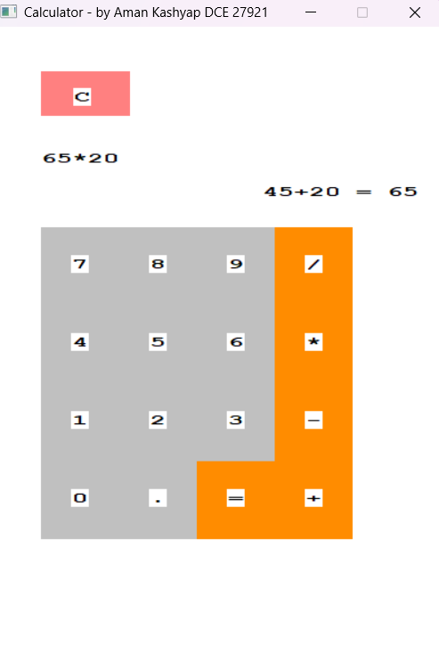
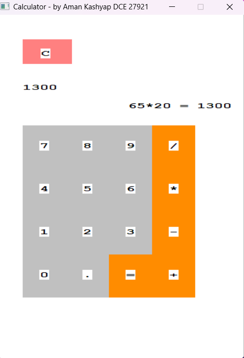

# 🧮 Calculator Project (C++ + Web Integration)

> A graphical calculator built using **C++ (WinBGI)** with advanced arithmetic logic, extended into a **web-based portfolio** using HTML5, CSS3, and JavaScript.

---

## 📌 Project Overview

This project demonstrates:
- Graphical UI rendering using `graphics.h` (WinBGI)
- Expression-based arithmetic evaluation
- Smooth interaction with mouse events
- Web integration using SPA (Single Page Application)

The web version replicates the same logic and UI behavior of the C++ calculator.

---

## ✨ Key Features

- 🖥️ Graphical calculator UI (C++)
- 🧠 Expression-based arithmetic evaluation (`23+24*2`)
- 🔢 Decimal and chained operations support
- ⚡ Flicker-free rendering using double buffering
- 🌐 Web version with same UI & logic
- 📄 SPA-based portfolio with dynamic content loading

---

## 🛠️ Technology Stack

### 🔹 Core Application
- C++
- graphics.h (WinBGI)
- Windows API

### 🔹 Web Portfolio
- HTML5
- CSS3
- JavaScript (SPA + AJAX)

---

## 📸 Project Screenshots

### 🖥️ C++ Calculator UI




### ➕ Input & Output Behavior



### 🔁 Chained Operations



### ✅ Final Result



---

## 🧠 Working Logic

### 🔹 Input Handling

- User input is stored as a string expression:
 input = "23+24"


- Prevents:
- Multiple decimal points
- Invalid operator chaining

---

### 🔹 Evaluation Logic

- Uses **stack-based parsing algorithm**
- Supports operator precedence:


---

### 🔹 Output Behavior

Example:

23 + 24 = 47
47 * 10 = 470


- Left → current result
- Right → full expression history

---

## 🌐 Web Version

The project includes a **web-based calculator** with:

- Same UI layout
- Same arithmetic logic
- Dynamic navigation (SPA)

📂 Structure:

```
/project
│
├── index.htm
├── Assets/
│ ├── Calculator.htm
│ ├── Navigation.htm
│ ├── main.htm
│ ├── header.htm
│ ├── footer.htm
│ └── loader_manager.js
```


---

## 🚀 How to Run

### 🔹 C++ Version

1. Install WinBGI (graphics.h)
2. Compile using CodeBlocks / Dev C++
3. Run the `.cpp` file

---

### 🔹 Web Version

1. Open `index.htm` in browser
2. Navigate using menu
3. Use **Live Calculator**

---

## 📚 Learning Outcomes

- Event-driven programming in C++
- UI design using low-level graphics
- Expression parsing algorithms
- SPA development using JavaScript
- Integration of desktop + web technologies

---

## 📌 Future Improvements

- ⌨️ Keyboard input support
- 📜 Calculation history panel
- 🔬 Scientific calculator functions
- 🌙 Dark mode UI
- 🌐 Deployment (GitHub Pages)

---

## 👨‍💻 Author

**Aman Kashyap**  
🎓 DCE | Roll No: 27921  

---

## 📄 License

This project is for **academic and portfolio purposes only**.
